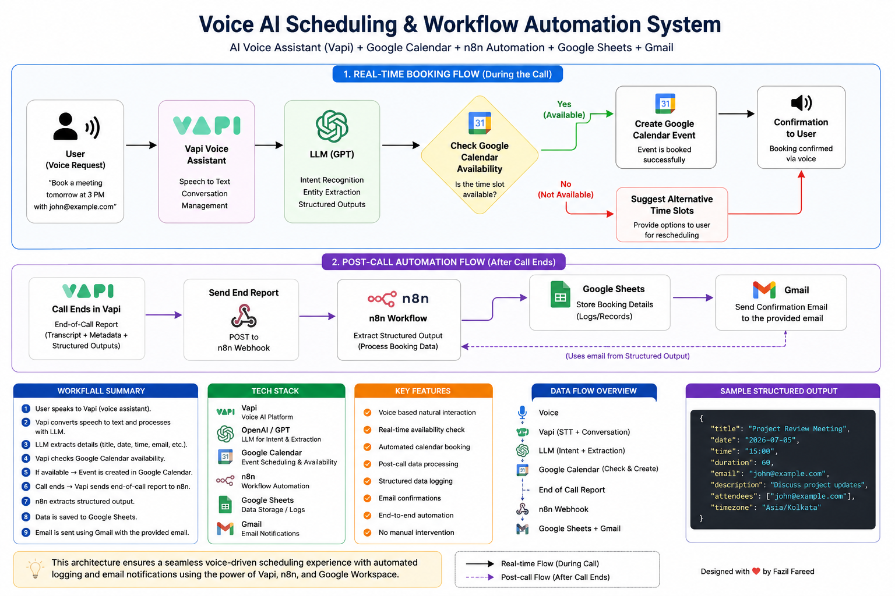

# 🎙️ Voice AI Scheduling System

An end-to-end AI-powered voice scheduling system that enables users to book appointments using natural conversation. The assistant checks calendar availability in real time, creates calendar events, and performs post-call workflow automation including logging booking details and sending confirmation emails.

---

# Overview

This project demonstrates how modern AI voice agents can automate scheduling workflows by integrating conversational AI with cloud productivity tools.

The assistant understands natural language, extracts structured scheduling information, validates availability, books appointments, and automatically performs follow-up tasks after the call.

---

# Features

- 🎤 Natural voice conversations
- 🧠 AI-powered intent recognition
- 📅 Google Calendar availability checking
- ✅ Automatic event creation
- 📄 Structured output generation
- 🔗 n8n webhook integration
- 📊 Google Sheets booking log
- 📧 Gmail confirmation emails
- ⚡ End-to-end workflow automation

---

# System Architecture



---

# Workflow

## During the Call

1. User speaks with the AI assistant.
2. Vapi converts speech into text.
3. The LLM extracts scheduling information.
4. Google Calendar is checked for availability.
5. If available, the appointment is created.
6. The assistant confirms the booking.

---

## After the Call

Once the conversation ends:

1. Vapi generates an End-of-Call Report.
2. The report contains:
   - Transcript
   - Metadata
   - Structured Output
3. Vapi sends the report to an n8n webhook.
4. n8n extracts the booking details.
5. Booking information is stored in Google Sheets.
6. Gmail sends a confirmation email to the attendee.

---

# Architecture

```text
              User
                │
                ▼
        Vapi Voice Assistant
                │
                ▼
               LLM
                │
                ▼
          Google Calendar
                │
                ├── Check Availability
                └── Create Event
                │
                ▼
        Booking Confirmation
                │
                ▼
           End of Call
                │
                ▼
             Webhook
                │
                ▼
               n8n
                ├── Google Sheets
                └── Gmail
```

---

# Tech Stack

| Technology      | Purpose                        |
| --------------- | ------------------------------ |
| Vapi            | Voice AI Assistant             |
| OpenAI GPT      | Natural Language Understanding |
| Google Calendar | Availability & Event Creation  |
| n8n             | Workflow Automation            |
| Google Sheets   | Booking Storage                |
| Gmail           | Email Notifications            |

---

# Sample Structured Output

```json
{
  "title": "Project Meeting",
  "date": "2026-07-05",
  "time": "15:00",
  "duration": 60,
  "userEmail": "john@example.com",
  "confirmed": true
}
```

---

# Project Highlights

- Real-time calendar availability checking
- AI-powered voice scheduling
- Automatic appointment booking
- End-of-call data processing
- Multi-service workflow automation
- Structured output extraction
- Cloud-based integrations

---

# Future Improvements

- Outlook Calendar support
- Zoom & Google Meet link generation
- SMS confirmations
- CRM integration
- Multi-language support
- RAG-based company knowledge
- Database support (MongoDB/PostgreSQL)
- Analytics Dashboard

---
